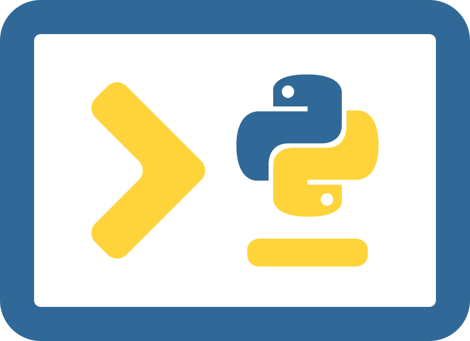

<!-- PROJECT LOGO -->
 

  

<h1 align="center">TERMIpy</h1>

  

    Make your py terminal look great. 
     
    <a href="https://github.com/ajd1776/TERMIpy"><strong>Explore the docs »</strong></a>
     
     
    <a href="#Demos">View Demo</a>
    ·
    <a href="https://github.com/ajd1776/TERMIpy/issues">Report Bug</a>
    ·
    <a href="https://github.com/ajd1776/TERMIpy/issues">Request Feature</a>
  

<!-- PROJECT SHIELDS -->

 
   
   
   
   
   

  </a>
  </a>
  </a>

<!-- TABLE OF CONTENTS -->

  
<b>Table of Contents</b>

  <ol>
    <li>
      <a href="#about-the-project">About The Project</a>
      <ul>
        <li><a href="#built-with">Built With</a></li>
        <li><a href="#features">Features</a></li>
      </ul>
    </li>
    <li><a href="#usage">Usage</a></li>
    <li><a href="#roadmap">Roadmap</a></li>
    <li><a href="#contributing">Contributing</a></li>
    <li><a href="#license">License</a></li>
  </ol>

<!-- ABOUT THE PROJECT -->
## About The Project

### Built With

Hosted On [PythonAnywhere](https://www.pythonanywhere.com) with a free plan.

### Features
- [x] 

(<a href="#readme-top">back to top</a>)

<!-- USAGE EXAMPLES -->
## Usage

### Demos

(<a href="#readme-top">back to top</a>)

<!-- ROADMAP -->
## Roadmap

- [x] Add ability for 

See the [open issues](https://github.com/github_username/repo_name/issues) for a full list of proposed features (and known issues).

(<a href="#readme-top">back to top</a>)

<!-- CONTRIBUTING -->
## Contributing
Any contributions you make are **greatly appreciated**.

If you have a suggestion that would make this better, please fork the repo and create a pull request. You can also simply open an issue with the tag "enhancement".
Don't forget to give the project a star! Thanks again!

1. Fork the Project
2. Create your Feature Branch (`git checkout -b feature/AmazingFeature`)
3. Commit your Changes (`git commit -m 'Add some AmazingFeature'`)
4. Push to the Branch (`git push origin feature/AmazingFeature`)
5. Open a Pull Request

(<a href="#readme-top">back to top</a>)

<!-- LICENSE -->
## License

Distributed under the MIT License. See `LICENSE.txt` for more information.

(<a href="#readme-top">back to top</a>)

[product-screenshot]: (https://github.com/ajd1776/TERMIpy/assets/48261946/9a1574d3-de84-4caf-923a-ee09e52df5a0)
